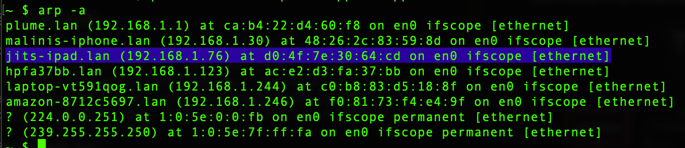
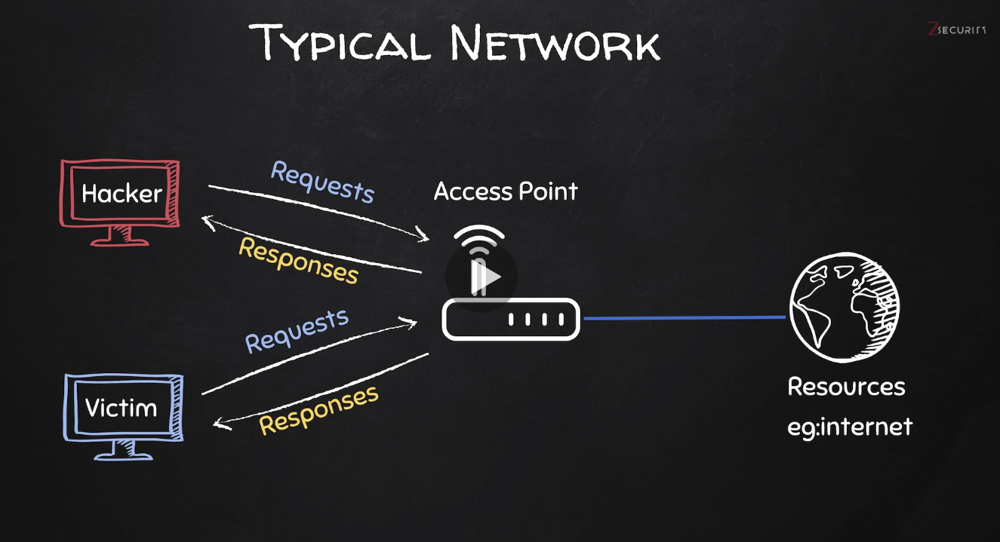
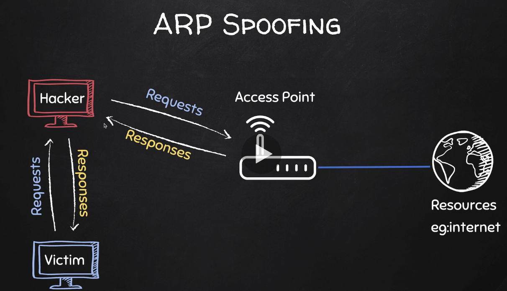
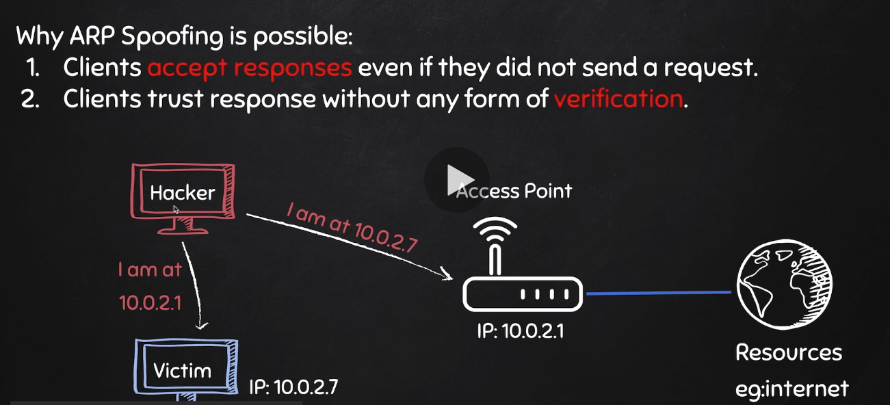
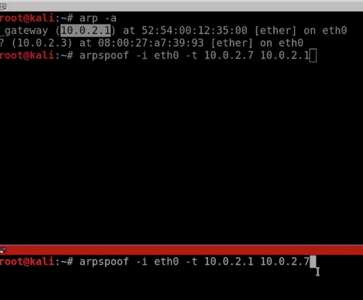
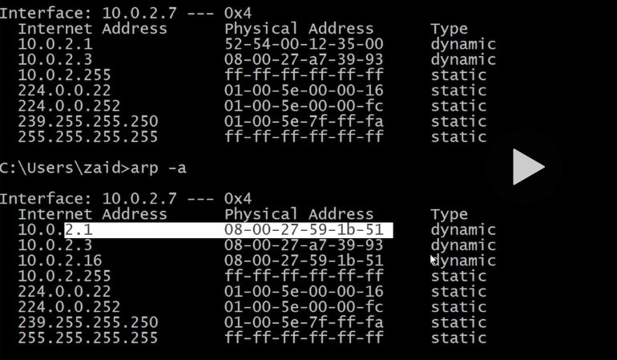

# ARP Spoofing

## ARP (Address resolution Protocol)

ARP allows clients connected to same network to communicate each other by obtaining their Mac Address. Every client in a network stores an ARP table that resolves mac address of other clients in network. Every clients in same network communicates using Mac address. As shown  below it resolves IP address and corresponding Mac.

Let us say a hacker entered into your network. We will see how the hacker can do ARP Spoofing. Given below is our network before ARP Spoofing.

ARP Spoofing allows a hacker to redirect the flow of packets. So instead of flowing as shown below, it will be like this. All request and response to and from gateway will flow through the hacker computer. That means all messages, user name , passwords , images will flow through hacker computer which enables hacker to read/modify/drop these messages. (ARP is not secure)

## How it works ? 
This works because, ARP is not a secure protocol. Any machine in network can send an ARP resonse to any other machine in network, which inturn can update the ARP table of that victim machine. As shown below the hacker machine in the network is sending a response to Victim, saying its the Gateway. In the same way, its sending a response to the "Gateway" saying its Victim. 

 Kali Linux,comes with 'arpsoof' to do this. Given below is that sample. 

At first we are sending an ARP response to '10.0.2.7' that I am 10.0.2.1

Second, we are sending an ARP response to '10.0.2.1' (Gateway) that I am '10.0.2.7' the victim. This can happend in any adapter, (Ethernet, wireless). Here we specified 'eth0' interface.

Given below is the arp table of 'Victim' before and after spoofing. As you can see the 'gateway' Mac address is switched to Kali's .

## Port Forwarding

At this stage, the requests from the 'Victim' will be directed to the 'Hacker', but nothing will happen,since we are not forwarding that request to the 'gateway'. (Example: If you try to launch a webpage in browser from Victim will not work). For this to work, we need to enable  portforwarding in our 'hacker'

  

