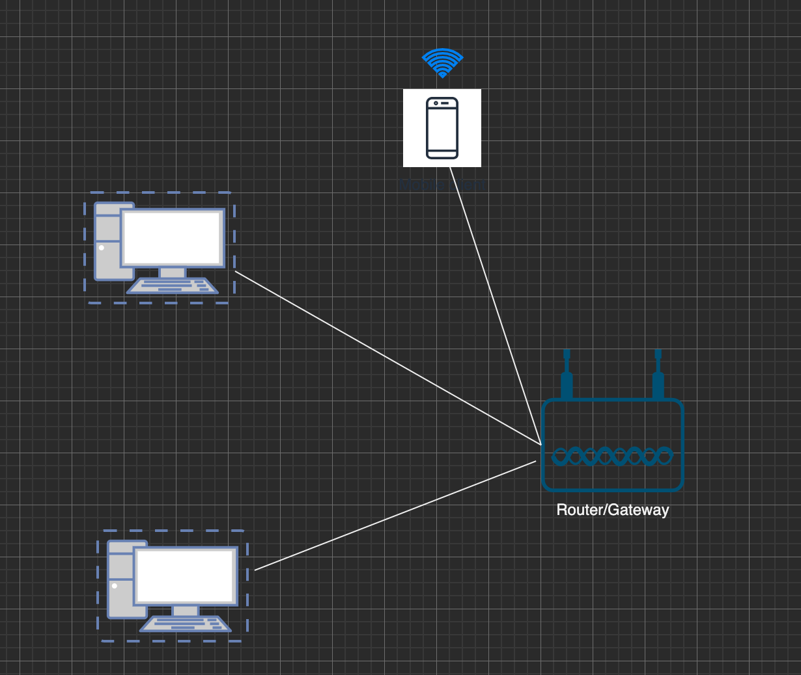
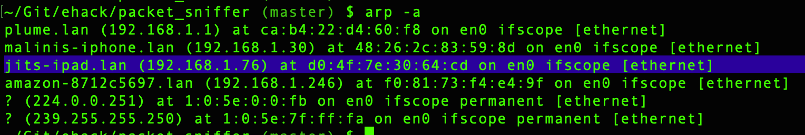
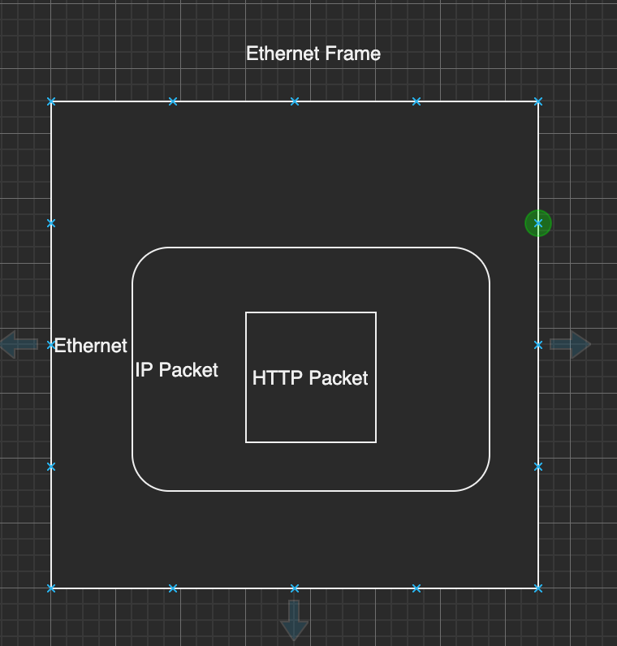
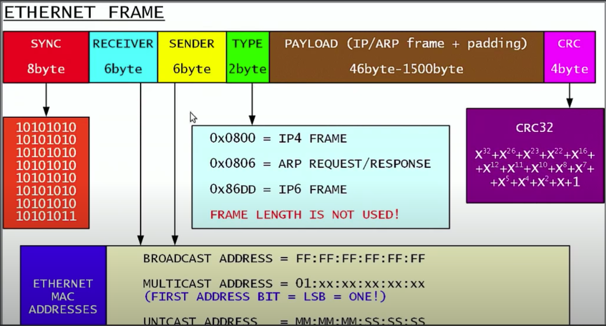
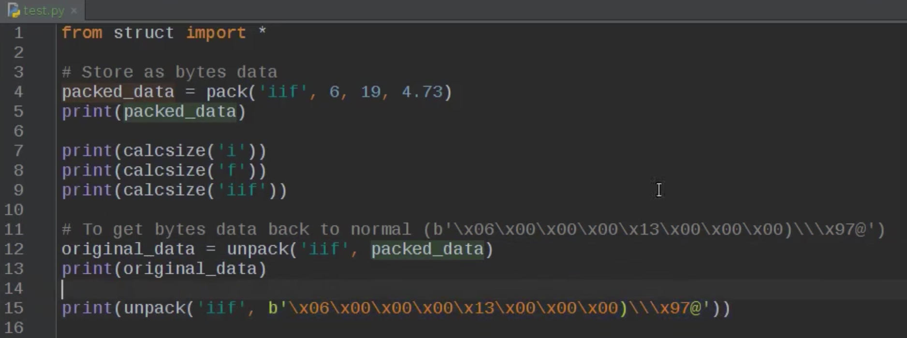
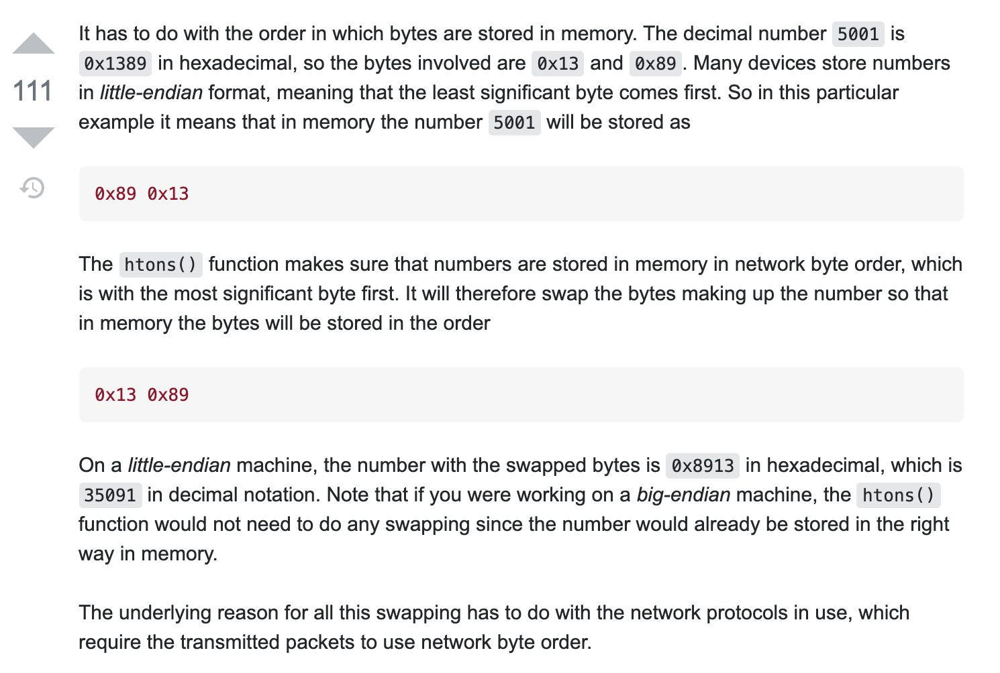

# Packet Sniffer

<!-- TOC -->

- [Packet Sniffer](#packet-sniffer)
    - [Subnet](#subnet)
    - [Pack and Unpack in Python](#pack-and-unpack-in-python)
    - [htons() function in socket programing](#htons-function-in-socket-programing)
    - [References](#references)

<!-- /TOC -->

## Subnet

A network/subnet is a group of devices connected together via a router (gateway). Each device will have a network adapter (interface) that connects it to the router/gateway. The connected interface (physical) has a mac address as well as a network address (IP address). 

When we think of a packet route, it starts from a device connected to a network. The packets transferred between two devices part of same network are called "Ethernet Packet". Ethernet packets are transferred via mac address. Each device connected to a network maintains a table called as "ARP Table". ARP stands for Address Resolution Protocol. This table maps the ip address of device in network to its mac address. 

You can get mac address of any devices connected to the network by broadcasting an ARP request to the broadcast address. 

So an ethernet packet gets transferred to the device in same network via mac address.

Let us say you are sending an HTTP request (Browsing www.google.com). This HTTP request gets wrapped in an IP packet, where Source IP is your IP and destination IP is 'Googles',which inturn gets wrapped in an Ethernet packet which contains your  source mac address and destination mac address will be your gateways (routers) mac addresss. 

Now let us dissect and ethernet frame. 

sync: ensures that your device and router are in sync in receiving the data (Electrical stuff)

CRC (frame check, to ensure packet is received as send)

Receiver : Mac address of the router's interface
Sender : Mac address of the device's interface
Type : Type of packet enclosed inside ethernet packet. (IP packet or Arp ..)
Payload : Actual data transferred.

## Pack and Unpack in Python  

When ever we needs to store data as bytes we use pack and to get back actual data from bytes we use unpack.  
i = integer (4 bytes)  
f = float. (4 bytes)  
iif = 2 integers and 1 float (12 bytes)  
s = character (1 byte)  
H = small unsigned int (2 byte)  

  

## htons() function in socket programing

_htons is host-to-network short_ This means it works on 16-bit short integers. i.e. 2 bytes. This function swaps the endianness of a short. It ensures that number is stored in memory in Network Byte Order.

## References

https://www.youtube.com/playlist?list=PL6gx4Cwl9DGDdduy0IPDDHYnUx66Vc4ed
